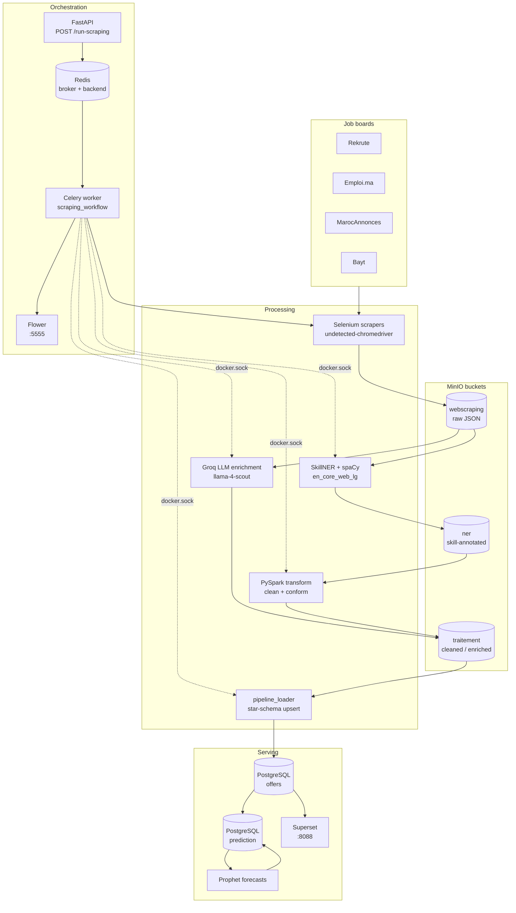

# Job Market Research — Data & AI Jobs in Morocco

An end-to-end, containerised data platform that **scrapes job postings from Moroccan job boards, enriches them with NLP/LLM skill extraction, loads them into a PostgreSQL star schema, visualises them in Apache Superset, and forecasts hiring demand with Prophet.**

The business question it answers: *which Data & AI skills, job titles, sectors and contract types are actually in demand on the Moroccan job market, and where is that demand heading?*

---

## Table of contents

- [What this project does](#what-this-project-does)
- [Architecture](#architecture)
- [The pipeline, step by step](#the-pipeline-step-by-step)
- [Repository layout](#repository-layout)
- [Data model](#data-model)
- [Getting started](#getting-started)
- [Environment variables](#environment-variables)
- [Services and ports](#services-and-ports)
- [Running things manually](#running-things-manually)
- [Technology stack](#technology-stack)
- [Development workflow](#development-workflow)
- [Known issues and rough edges](#known-issues-and-rough-edges)
- [Project documents](#project-documents)

---

## What this project does

1. **Collects** job postings from four Moroccan job boards, searching for the keyword `data`:
   | Source | Site | Scraper |
   |---|---|---|
   | Rekrute | `rekrute.com` | [Rekrute.py](data_extraction/Websites/Rekrute.py) |
   | Emploi.ma | `emploi.ma` | [emploi.py](data_extraction/Websites/emploi.py) |
   | MarocAnnonces | `marocannonces.com` | [MarocAnn.py](data_extraction/Websites/MarocAnn.py) |
   | Bayt | `bayt.com/en/morocco` | [bayt.py](data_extraction/Websites/bayt.py) |

2. **Validates** every posting against a shared JSON schema ([Job_schema.json](data_extraction/Websites/Job_schema.json)) and de-duplicates on `job_url`.

3. **Extracts skills** from the free-text description using two interchangeable approaches:
   - **SkillNER + spaCy** (`en_core_web_lg`) — deterministic NER against the SkillNER skill database, splitting results into `hard_skills` / `soft_skills`.
   - **Groq LLM** (`meta-llama/llama-4-scout-17b-16e-instruct`) — normalises *every* field (title, sector, education, seniority, contract) and emits a clean skill list, with a rule-based fallback profile when the API fails.

4. **Cleans and conforms** the data with a PySpark job: normalises the many date formats, trims and splits multi-value fields, flattens skills into `{nom, type_skill}` records, drops duplicates.

5. **Loads** into a PostgreSQL star schema (`offers` database) built around a `fact_offre` table with eight dimensions and an offer↔skill bridge table.

6. **Serves analytics** through Apache Superset (a pre-built dashboard export is included) and **forecasts** future posting volume per segment (global, sector, title, skill, contract, source) with Facebook Prophet in a separate `prediction` database.

Every stage is a container; every stage hands off through **MinIO** object storage; the whole chain is orchestrated by **Celery**.

---

## Architecture



**A note on how orchestration works.** The Celery worker does not import the heavy processing code. Instead, `/var/run/docker.sock` is mounted into the worker container, and each task (`skillner_ner`, `spark_cleaning`, `pipeline_loader`, `enrichment_process`) *builds the image if missing and runs a sibling container* on the `job_analytics_app_default` network, waiting for it to exit. This keeps Spark, spaCy and Prophet dependencies out of the worker image at the cost of giving the worker Docker-daemon access.

---

## The pipeline, step by step

The canonical chain is the `scraping_workflow` task in [celery_app/tasks.py](celery_app/tasks.py#L220-L230):

```
emploi → rekrute → marocannonce → scrape_upload → skillner_ner → spark_cleaning → pipeline_loader
```

| # | Task | What it does | Reads | Writes |
|---|---|---|---|---|
| 1–3 | `emploi`, `rekrute`, `marocannonce` | Headless-Chrome scraping, schema validation, dedupe. Retries 3× with a 5 s delay. | job boards | `data_extraction/scraping_output/*.json` |
| 4 | `scrape_upload` | Creates buckets, uploads every scraped file | local JSON | bucket `webscraping` |
| 5 | `skillner_ner` | spaCy + SkillNER skill extraction; writes `NER_*.json` | bucket `webscraping` | bucket `ner` |
| 6 | `spark_cleaning` | PySpark clean/conform via `s3a://` | bucket `ner` | bucket `traitement` |
| 7 | `pipeline_loader` | Star-schema upsert, skipping existing `job_url`s | bucket `traitement` | PostgreSQL `offers` |

Two tasks exist but sit **outside** this chain and must be triggered on their own:

- **`bayt`** — the Bayt scraper. Implemented and registered, but not wired into `scraping_workflow`.
- **`enrichment_process`** — the Groq LLM enrichment path. It is an *alternative* to steps 5–6: it reads `webscraping` directly and writes enriched profiles straight to `traitement`, in the exact shape `pipeline_loader` expects. Sample outputs live in [traitement/](traitement/).

**Prediction** is a separate, manually-run stage. [prediction/manage_tables.py](prediction/manage_tables.py) creates the `prediction` database, then aggregates `offers` into daily time series (`ds`, `y`) across six segment types plus a table of calendar regressors (weekends, French public holidays, hiring seasons). [prediction/train_model.py](prediction/train_model.py) fits Prophet and produces a 30-day forecast.

---

## Repository layout

```
Job_market_research/
├── celery_app/                  # Orchestration
│   ├── tasks.py                 #   all Celery tasks + the scraping_workflow chain
│   ├── celeryconfig.py          #   Redis broker/backend, event reporting for Flower
│   ├── api.py                   #   FastAPI trigger + task-status endpoints
│   ├── start.sh                 #   runs worker and uvicorn together
│   └── Dockerfile.flower        #   Flower monitoring UI image
│
├── data_extraction/
│   ├── Websites/                # One module per job board
│   │   ├── __init__.py          #   shared helpers: init_driver, save_json,
│   │   │                        #   validate_json, check_duplicate, setup_logger
│   │   ├── Job_schema.json      #   the contract every scraper must satisfy
│   │   ├── Rekrute.py  emploi.py  MarocAnn.py  bayt.py
│   │   └── scraping_output/     #   raw scraped JSON (committed samples, ~2 100 offers)
│   └── Traitement/              # Legacy: Groq title normalisation + MongoDB sink
│
├── database/__init__.py         # MinIO client helpers used by the Celery worker
├── Postgres/                    # Star-schema loader (built as pipeline_loader)
│   ├── _init_postgres.py        #   get_or_create_dimension, insert_offer, load_offers
│   └── load_offers.py           #   entrypoint: load from the `traitement` bucket
│
├── skillner/                    # spaCy + SkillNER skill extraction service
│   ├── skillner_logic.py        #   annotate → map skill ids → merge → upload
│   └── utils.py                 #   its own copy of the MinIO helpers
│
├── enrechissement_process/      # Groq LLM enrichment service
│   ├── init_groq.py             #   prompt, streaming call, JSON extraction, fallback
│   ├── main_enrechissement_pipeline.py
│   └── utils__init__.py         #   MinIO helpers + normalize_offer
│
├── spark_pipeline/
│   ├── transform_job.py         # the cleaning job actually used by the pipeline
│   ├── insert_to_postgres.py    # alternative direct-to-Postgres loader (different schema)
│   └── postgresql-42.7.3.jar    # JDBC driver baked into the Spark image
│
├── prediction/                  # Prophet forecasting
│   ├── manage_tables.py         #   builds the `prediction` DB and its time series
│   ├── train_model.py           #   fits Prophet, prints a 30-day forecast
│   └── main.py                  #   stub / scratch script
│
├── superset/                    # BI layer
│   ├── setup.sh                 #   db upgrade, admin user, registers the `offers` DB
│   ├── superset_config.py       #   feature flags + DxC colour scheme
│   └── dashboard_export_*.zip   #   importable dashboard
│
├── docker-entrypoint-initdb.d/schema.sql   # star schema, applied on first PG boot
├── dockercompose.dev.yaml       # full local stack — start here
├── dockercompose.prod.yaml      # slim stack + Prometheus/Grafana
├── Dockerfile                   # the shared app_worker image (uv + Chrome + chromedriver)
├── prometheus.yml               # scrapes flower and minio
├── pyproject.toml / uv.lock     # dependency source of truth (uv)
├── requirements.txt             # flat pip export (212 pins)
├── output/ · traitement/        # sample and generated datasets
└── documents/                   # reports, presentations, deployment guides (V0, V1)
```

---

## Data model

The `offers` database is a classic star schema ([schema.sql](docker-entrypoint-initdb.d/schema.sql)).

```
                  dim_date ──┐
                dim_source ──┤
               dim_contrat ──┤
                 dim_titre ──┼──►  fact_offre  ◄──►  offre_skill  ◄──►  dim_skill
             dim_compagnie ──┤      (job_url,                            (nom,
        dim_niveau_etudes ──┤       description,                        type_skill:
    dim_niveau_experience ──┘       competences,                        hard | soft)
                                    secteur)
```

- **`fact_offre`** — one row per posting, unique on `job_url`, with FKs to all seven dimensions.
- **`dim_date`** is pre-decomposed into `jour`, `mois`, `trimestre`, `annee`, `jour_semaine` so Superset can slice on any grain.
- **`dim_compagnie`** carries `secteur` as an attribute.
- **`offre_skill`** is the many-to-many bridge that makes "top skills over time" queries cheap.
- Loading is idempotent: dimensions go through `INSERT … ON CONFLICT DO UPDATE … RETURNING`, and an offer whose `job_url` already exists is skipped.

The `prediction` database holds `ts_prophet_data` (long-format `ds`/`y` series keyed by `segment_type` + `segment_id`), `ts_regressors`, `prophet_forecasts`, `model_performance` and `prophet_run_logs`.

The wire format between stages is the **offer JSON**, required fields `job_url`, `titre`, `via`, `publication_date`. **Any new scraper must satisfy [Job_schema.json](data_extraction/Websites/Job_schema.json)** — everything downstream assumes it.

---

## Getting started

### Prerequisites

- Docker and Docker Compose
- A Groq API key, only if you want the LLM enrichment path
- ~8 GB free RAM (Spark + spaCy `en_core_web_lg` + Superset are the hungry ones)

### 1. Create the environment file

The stack reads a **`.docker.env`** file at the repo root. It is git-ignored and not committed, so create it:

```dotenv
# --- MinIO ---
MINIO_API=minio:9000
MINIO_ROOT_USER=minioadmin
MINIO_ROOT_PASSWORD=minioadmin

# --- PostgreSQL ---
POSTGRES_USER=root
POSTGRES_PASSWORD=123456
POSTGRES_DB=offers
DB_HOST=postgres
DB_PORT=5432

# --- Chrome (paths inside the app_worker image) ---
CHROME_BIN=/opt/chrome/chrome
CHROME_DRIVER_DIR=/home/celery_user/.local/share/undetected_chromedriver
LOG_DIR=/var/log

# --- Superset (optional, defaults shown) ---
SUPERSET_SECRET_KEY=testkey
SUPERSET_ADMIN_PASSWORD=admin

# --- Groq (optional, for the enrichment path) ---
GROQ_API_KEY=gsk_...
```

> Every service reads these from the environment, falling back to the values shown above if they
> are absent — so the stack comes up with the file exactly as written, and changing a value here
> is enough. `.docker.env` is loaded via Compose `env_file:`, **not** `${...}` interpolation, so
> no root `.env` is needed.

### 2. Bring up the stack

```bash
docker compose -f dockercompose.dev.yaml up -d --build
```

`postgres` applies `docker-entrypoint-initdb.d/schema.sql` on its **first** boot only. If you change the schema, recreate the volume: `docker compose -f dockercompose.dev.yaml down -v`.

### 3. Run the pipeline

The `data_extraction` service fires `scraping_workflow` once at startup. To trigger it again:

```bash
docker exec -it celery_container python /app/data_extraction/web_scrape.py
```

Or through the FastAPI layer (the `api` service, port 8000):

```bash
curl -X POST http://localhost:8000/run-scraping
curl http://localhost:8000/task-status/<task_id>
```

`/task-status/<id>` reports the state of the **last** task in the chain, which is
`pipeline_loader` — so `SUCCESS` there means the whole pipeline finished.

Watch progress in **Flower** at <http://localhost:5555>.

### 4. Explore the results

- **Superset** <http://localhost:8088> — log in `admin` / `admin`, then import `superset/dashboard_export_20250807T121001.zip`.
- **Adminer** <http://localhost:8080> — server `postgres`, database `offers`.
- **MinIO console** <http://localhost:9080> — inspect the `webscraping`, `ner` and `traitement` buckets.

### 5. Build the forecasts (optional)

```bash
# Rebuild the ts_prophet_data / ts_regressors series from the star schema
docker exec -it prediction_container python /app/prediction/manage_tables.py

# Fit Prophet on one series. Defaults to the global daily series.
docker exec -it prediction_container python /app/prediction/train_model.py
docker exec -it prediction_container python /app/prediction/train_model.py \
  --segment-type titre --segment-id 12 --granularity monthly
```

A series is identified by `(segment_type, segment_id, granularity)`. `segment_type` is one of
`global`, `secteur`, `titre`, `skill`, `contrat`, `source`; the global series always uses
`segment_id 0`.

---

## Environment variables

| Variable | Used by | Purpose |
|---|---|---|
| `MINIO_API` | every stage | MinIO endpoint, e.g. `minio:9000` |
| `MINIO_ROOT_USER` / `MINIO_ROOT_PASSWORD` | every stage | Object-storage credentials |
| `POSTGRES_USER` / `POSTGRES_PASSWORD` / `POSTGRES_DB` | postgres, loader, prediction, superset | Database bootstrap and connection; defaults `root` / `123456` / `offers` |
| `DB_HOST` / `DB_PORT` | loader, prediction, superset | PostgreSQL host and port; defaults `postgres` / `5432` |
| `PREDICTION_DB` | `prediction/train_model.py` | Forecast database name; default `prediction` |
| `SUPERSET_SECRET_KEY` | superset | Session signing / credential encryption key; default `testkey` |
| `SUPERSET_ADMIN_PASSWORD` | superset | Password for the `admin` account; default `admin` |
| `CHROME_BIN` | scrapers | Chrome binary path; `init_driver` **raises** if unset |
| `CHROME_DRIVER_DIR` | scrapers | Directory holding `chromedriver`; also **required** |
| `LOG_DIR` | scrapers | Log destination; falls back to a local `log/` folder |
| `GROQ_API_KEY` | enrichment | Groq API key (`gsk_…`) |
| `MONGO_DB_URI` | legacy `Traitement/` | MongoDB Atlas URI, only for the legacy path |

---

## Services and ports

| Service | Port | Purpose |
|---|---|---|
| FastAPI (`api`) | 8000 | Pipeline trigger + task status |
| Flower | 5555 | Celery task monitoring |
| Redis | 6379 | Broker and result backend |
| Redis Commander | 8081 | Redis inspection UI |
| MinIO API | 9000 | S3-compatible object storage |
| MinIO Console | 9080 | Bucket browser |
| PostgreSQL | 5432 | `offers` and `prediction` databases |
| Adminer | 8080 | SQL client |
| Superset | 8088 | Dashboards (`admin` / `admin`) |
| Prometheus | 9090 | Metrics (prod compose) |
| Grafana | 3000 | Metrics dashboards (prod compose) |

---

## Running things manually

Each processing stage is a normal script and can be run on its own — useful when iterating.

```bash
# A single scraper (inside the worker, which has Chrome)
docker exec -it celery_container python -m data_extraction.Websites.Rekrute

# Create the MinIO buckets
docker exec -it celery_container python database/setup_buckets.py

# Skill extraction
docker compose -f dockercompose.dev.yaml run --rm skillner python skillner_logic.py

# Spark cleaning
docker compose -f dockercompose.dev.yaml run --rm spark_transform spark-submit /opt/transform_job.py

# Load into the star schema
docker compose -f dockercompose.dev.yaml run --rm pipeline_loader python load_offers.py

# Groq enrichment
docker compose -f dockercompose.dev.yaml run --rm enrechissement_processor \
  python /app/enrechissement_process/main_enrechissement_pipeline.py
```

Individual Celery tasks can also be invoked by name:

```bash
docker exec -it celery_container python -c \
  "from celery_app.tasks import bayt_task; print(bayt_task.delay().id)"
```

---

## Technology stack

| Layer | Technology |
|---|---|
| Language | Python 3.10 (Prophet service: 3.12) |
| Dependency management | [uv](https://github.com/astral-sh/uv) — `pyproject.toml` + `uv.lock` |
| Scraping | Selenium 4.30, `undetected-chromedriver`, headless Chrome for Testing |
| Validation | `jsonschema` against `Job_schema.json` |
| Orchestration | Celery 5.5 + Redis; Flower for monitoring |
| API | FastAPI + Uvicorn |
| Object storage | MinIO (S3-compatible, accessed via `s3a://` from Spark) |
| NLP | spaCy 3.8 (`en_core_web_lg`) + SkillNER |
| LLM enrichment | Groq — `meta-llama/llama-4-scout-17b-16e-instruct` |
| Batch processing | PySpark 3.3.2 (`bitnami/spark`) + `hadoop-aws` |
| Warehouse | PostgreSQL (star schema) |
| BI | Apache Superset |
| Forecasting | Prophet, pandas |
| Monitoring | Prometheus + Grafana (prod compose) |
| Quality | pre-commit — ruff, ruff-format, isort; GitHub Actions on push/PR |

---

## Development workflow

```bash
# Local dev environment
uv sync

# Linting and formatting (runs in CI too)
pre-commit install
pre-commit run --all-files
```

Formatting is enforced by [.github/workflows/linting.yaml](.github/workflows/linting.yaml) on every push and on PRs to `main`.

**Adding a new job board:**

1. Create `data_extraction/Websites/<Source>.py` exposing a `main()` that returns a list of offers.
2. Use the shared helpers from [`data_extraction/Websites/__init__.py`](data_extraction/Websites/__init__.py): `init_driver()`, `load_json()`, `check_duplicate()`, `validate_json()`, `save_json()`, `setup_logger()`.
3. Emit objects satisfying `Job_schema.json`, with `via` set to your source name.
4. Register a `@shared_task` wrapper in `celery_app/tasks.py` and add it to the `scraping_workflow` chain.

Downstream stages need no changes — they key off the schema, not the source.

---

## Known issues and rough edges

The build and startup blockers this section used to list have been fixed. What remains below is
real, currently present in the codebase, and worth knowing before you debug something that was
never wired up.

**Incomplete**

- **`dockercompose.prod.yaml` is not a production stack.** It has no `postgres`, no `minio`, no
  `env_file`, and none of the pipeline stages — only Redis, the worker, Flower, Prometheus and
  Grafana. It parses and builds; it does not run the pipeline.
- **`prediction/main.py` is a stub** — it queries a placeholder `ta_table` and is not a working
  entrypoint. Use `manage_tables.py` and `train_model.py` instead.
- **Most forecasting tables are write-only or unused.** `ts_regressors` is populated but never
  read (there is no `add_regressor` call anywhere), and `prophet_forecasts`,
  `model_performance` and `prophet_run_logs` are created and never touched. `manage_tables.py`
  also `DROP`s and rebuilds all five tables on every run, so it is a full refresh, not an
  incremental load.
- **`spark_pipeline/insert_to_postgres.py` and `dockerfile.insert` target a different schema**
  (`dim_calendar`, `fact_offer`, English column names) than `schema.sql`, and no compose service
  references them. An alternative loader, not part of the active pipeline.
- **`data_extraction/Traitement/`** (Groq title normalisation → MongoDB) is a legacy path
  superseded by `enrechissement_process/`. It reads a `merged_jobs.json` that is not produced
  anywhere in the current pipeline.

**Hygiene**

- **The MinIO helper module is duplicated four times** — `database/__init__.py`,
  `Postgres/__init__.py`, `skillner/utils.py`, `enrechissement_process/utils__init__.py`. Fixes
  must be applied in all four. Consolidation is blocked by the build contexts: `skillner` and
  `Postgres` build from their own subdirectories, so a root-level shared module is unreachable
  by `COPY`, and `skillner`'s `./skillner:/app` mount would mask it anyway. Doing it properly
  means rewriting both Dockerfiles, changing both compose contexts, updating the `tasks.py`
  build paths, and replacing `Postgres/_init_postgres.py`'s `from __init__ import *`.
- **Credentials now come from the environment but keep permissive defaults.** Every connection
  falls back to `root` / `123456` / `postgres:5432`, Superset's `SECRET_KEY` falls back to
  `"testkey"` and its admin login to `admin`/`admin`. Set `POSTGRES_USER`,
  `POSTGRES_PASSWORD`, `POSTGRES_DB`, `DB_HOST`, `DB_PORT`, `SUPERSET_SECRET_KEY` and
  `SUPERSET_ADMIN_PASSWORD` in `.docker.env` for anything beyond local work.
- **The Celery worker runs as `root` with `/var/run/docker.sock` mounted**, which is effectively
  host-root access. Required by the sibling-container design, but worth understanding.
- **`save_json()` calls `os.chdir()`**, mutating the process working directory — a hazard for
  anything run in the same process afterwards.
- **spaCy versions disagree** — `skillner/skillner_requirements.txt` pins `spacy==3.7.2` while
  the root project uses `3.8.4`.
- **`Dockerfile.prediction` installs its dependencies twice** — an explicit
  `pip install pandas prophet psycopg2-binary`, then `requirements_prediction.txt`.

---

## Project documents

Functional and operational documentation lives in [documents/](documents/), versioned by milestone:

| Version | Contents |
|---|---|
| **V0 — 17/06/2025** | Docker deployment guide; "Analyse des Compétences en Data et IA" presentation |
| **V1 — 05/08/2025** | Full project report; test sheet; updated deployment guide; "Use Case — Big Data & Analytics" presentation |

Committed sample datasets, useful for working on downstream stages without re-scraping:

| Path | Contents |
|---|---|
| `data_extraction/scraping_output/` | Raw scrapes — Rekrute (1 589), Bayt (481), Emploi.ma (32), MarocAnnonces (29) |
| `skillner/data/` | Skill-annotated samples (160 offers) |
| `traitement/` | Groq-enriched profiles (3 × 145 offers) |
| `output/offres_data_ai_2025.json` | Curated Data/AI subset (67 offers) |
